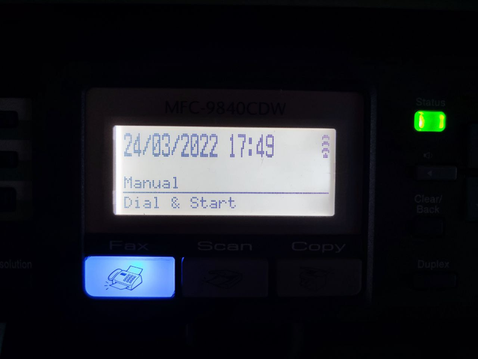

W tym wpisie opowiem o ewentualnej niedogodności drukarki Brother MFC-9840CDW. Uważam, że całe urządzenie zasługuje
na dłuższy artykuł opisujący co w tym dinozaurze działa od strony oprogramowania.

## Zakup

Parę tygodni temu kupiłem sobie w końcu drukarkę. Uznałem, że kupię coś z drugiej ręki,
eby zaoszczędzić trochę pieniędzy. Drukarki potrzebuję dość rzadko, więc szukałem wyłącznie drukarki laserowej.
Chciałem też, żeby drukowała w kolorze dwustronnie i miała dostępne części eksploatacyjne. Zaznaczę, że nie miałem pojęcia na temat
budowy ani obsługi drukarek laserowych, więc sprawdziłem tylko, czy tonery są w przystępnej cenie i czy w razie czego
kasetę da się kupić. Znalazłem dwie sztuki Brotherów MFC-9840CDW, jedna uszkodzona za 200 zł druga za 400 zł.
Oczywiście, nie mając prawie żadnej wiedzy, zdecydowałem się na sprawną po uprzednim zobaczeniu czy strona testowa
jest drukowana poprawnie. Sam transport drukarki był nie lada wyzwaniem, kloc waży chyba ze sto kilo
(tak serio waży około 40 kg i wg naklejki powinno się nosić ją w dwie osoby).


## Pierwsze wydruki

Pierwsze wydruki były naprawdę kiepskie, czarny działał idealnie, kolory tak sobie. Najgorzej radził sobie chyba oryginalny
toner Brothera. Po czyszczeniu i puszczeniu serii wydruków było już nieco lepiej, ale nadal nie idealnie.

## Software i ficzery

Najciekawszą rzeczą w tej drukarce były dla mnie ficzery. Urządzenie posiada całą masę funkcji sieciowych.


Z nich wszystkich najbardziej zaciekawiła mnie opcja skanowania do FTP. Od razu postawiłem serwer FTP na Raspberry Pi. 
Serwer można wpisać z palca fizycznie na drukarce. Można też skonfigurować sobie kilka predefiniowanych FTP i wybierać
je podczas skanowania z listy, co jest o wiele wygodniejsze i nie wymaga znania ani adresu, ani danych logowania. 

**Dokładnie do teraz myślałem, że pliki na FTP zapisywane są z datą w nazwie. Otóż nie xD, są z numerem porządkowym. 
Dalej będę opowiadał w takim razie, co sobie myślałem i co zrobiłem**

Jako że przyciski świecą dość mocno


A drukarka w IDLE pobiera prawie 30W, co nie jest wartością, którą mam zamiar tolerować,
szczególnie jeśli drukarki potrzebuję max raz w tygodniu. Teraz drukarka ma przełącznik na stałe w pozycji włączonej
i jest podłączona poprzez smart gniazdko Tenda, które nigdzie indziej mi akurat nie pasowało i walało się po szufladach.
Liczę, że samo smart gniazdko jest w stanie lepiej oszczędzać prąd ;)

**Niestety po odłączeniu od prądu ginie godzina oraz
niestety mimo mnogości różnych protokołów nie zauważyłem nigdzie obsługi NTP.**

Sprawdziłem jeszcze przed chwilą, czy na pewno nie leci żaden zbłąkany pakiet do jakiegoś nieżywego serwera NTP.
Na (nie) szczęście nie.


Pomijając już fakt, że ubzdurałem sobie nazwy plików z datą ze skanera, to po prostu nie lubię mieć źle ustawionych zegarków.
Nie wiem, czy te data i czas mają jakiekolwiek zastosowanie, być może przy faxowaniu ale tego jeszcze nie testowałem.

## Rozwiązanie ewentualnej niedogodności

Parę lat temu pracowałem w [Social WiFi](https://socialwifi.com/pl/), gdzie miałem okazję zapoznać się z SNMP 
(Simple Network Management Protocol). Nauczyłem się wtedy tego, że nie jest to wygodny sposób komunikacji z urządzeniami, 
ale całkiem dobrze sprawdza się do zbierania metryk. Nie inaczej było tym razem.

### SNMP

Najpierw próbowałem odnaleźć plik z bazą danych MIB (mapowanie OIDów na nazwy), 
pobieżne przeszukanie Internetu nie dało efektów. 
Napisałem do firmy Brother, ale nadal nie otrzymałem odpowiedzi.

Następnie skorzystałem z programu [MIB Browser od iReasoning](https://www.ireasoning.com/mibbrowser.shtml).
Tam bez problemu znalazłem OID który odpowiadał za datę i godzinę.

`1.3.6.1.2.1.25.1.2.0`

Do odczytania danych użyłem forka biblioteki [easysnmp](https://github.com/MichalMazurek/easysnmp2). 
Oryginalna biblioteka nie działała z nowszymi wersjami Pythona. Dzięki temu udało mi się ustalić format danych, w jakim 
powinienem ustawiać aktualny czas.

Początkowo miałem problem z ustawianiem czasu i myślałem, że należy użyć protokołu w wersji 3, ponieważ oprogramowanie
do zarządzania drukarką wymaga podania loginu i hasła. W celu sprawdzenia odpaliłem Wiresharka. Okazało się niestety, 
że wszystko leci bez jakichkolwiek zabezpieczeń w protokole wersji pierwszej... Z tego, co udało mi się znaleźć, 
to drukarka prawdopodobnie obsługuje SNMPv1 i SNMPv2c.

Ciekaw jestem, co robi ten przełącznik. Mam go ustawionego i nie zauważyłem żadnych zmian, a trochę liczyłem, że wyłącza
on protokół w wersji pierwszej, ale chyba nie, bo mój skrypt nadal działa.


Po małych walkach z formatem danych skończyłem mniej więcej z takim kodem, który pozwala ustawiać czas.

```python3
import datetime

from easysnmp import Session

oid = '1.3.6.1.2.1.25.1.2.0'
printer_ip = 'x.x.x.x'

def to_hex(d: datetime.datetime):
    return f'{d.year:04x}{d.month:02x}{d.day:02x}{d.hour:02x}{d.minute:02x}{d.second:02x}{0:02x}'


def set_current_date():
    session = Session(
        hostname=printer_ip,
        community='internal',
        version=1,
        retries=10,
        timeout=10,
    )
    new_datetime = bytearray.fromhex(to_hex(datetime.datetime.now())).decode('latin-1')
    session.set(oid, new_datetime, snmp_type='OCTETSTR')

```

### DHCP

Zostało jeszcze tylko jakoś uruchamiać ten skrypt. Bardzo nie chciałem, żeby chodził on co 5 minut i odpytywał drukarkę.
Chciałem, żeby działał możliwie szybko po włączeniu i nie zasypywał drukarki zbędnymi zapisami. Jako że drukarka ma 
u mnie ustawiony stały adres IP, to po włączeniu musi zrobić zapytanie do serwera DHCP z prośbą o przydzielenie jej 
tego konkretnego adresu. 

Z pomocą przyszła mi biblioteka [scapy](https://scapy.net/). 

Kod jest małą modyfikacją [tego tutaj](https://jcutrer.com/python/scapy-dhcp-listener) i wygląda w następujący sposób:

```python3
import time

from scapy.layers.dhcp import DHCP
from scapy.sendrecv import sniff

def get_option(dhcp_options, key):
    must_decode = ['hostname', 'domain', 'vendor_class_id']
    try:
        for i in dhcp_options:
            if i[0] == key:
                # If DHCP Server Returned multiple name servers
                # return all as comma seperated string.
                if key == 'name_server' and len(i) > 2:
                    return ",".join(i[1:])
                # domain and hostname are binary strings,
                # decode to unicode string before returning
                elif key in must_decode:
                    return i[1].decode()
                else:
                    return i[1]
    except Exception as e:
        pass

def handle_dhcp_packet(packet):
    if DHCP in packet and packet[DHCP].options[0][1] == 3:
        requested_addr = get_option(packet[DHCP].options, 'requested_addr')
        if requested_addr == printer_ip:
            print('Setting datetime in 60s...')
            time.sleep(60)  # wait for printer to be ready
            set_current_date()
    return


if __name__ == "__main__":
    sniff(filter="udp and (port 67 or 68)", prn=handle_dhcp_packet)

```


### system.d

Całość trzeba jakoś uruchomić po uruchomieniu systemu na Raspberry Pi, więc dopisałem taki kawałek konfiguracji:

`/lib/systemd/system/bro.service`

```ini
[Unit]
Description=Brother reversed time server
After=multi-user.target

[Service]
Type=simple
User=root
ExecStart=/home/pi/venvs/bro/bin/python /home/pi/bro/main.py
Restart=on-abort

[Install]
WantedBy=multi-user.target
```

Po czym włączyłem usługę i ją uruchomiłem

### RBPI

Najwięcej trudu wymagało zainstalowanie zależności do pakietu `easysnmp` na Rasbperry Pi Zero W ze względu na konieczność 
kompilacji NET SNMP. Brakowało wielu zależności do samego NET SNMP, a prędkość procesora niestety nie pomagała.
W efekcie puszczałem kompilację i zapominałem na parę godzin.

```shell
sudo systemctl enable bro.service
sudo systemctl start bro.service
```

## Sukces

I w ten oto sposób moja stara drukarka dostała nowe życie. A przynajmniej zegarek dostał.



Czy było warto? Póki nie wiedziałem, że pliki zapisują się z numerem początkowym (a nie datą), 
to jak najbardziej było warto. Teraz - raczej nie bardzo :(

